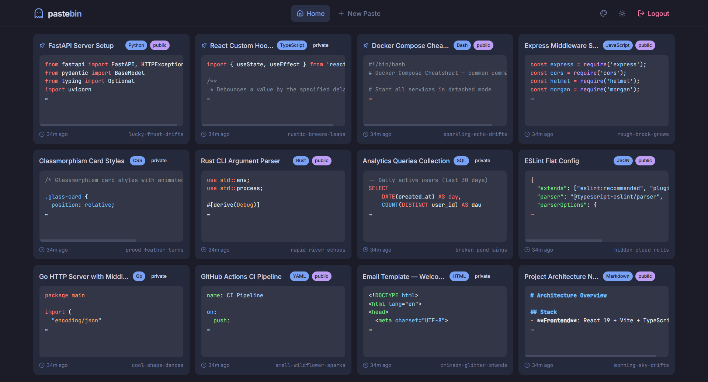
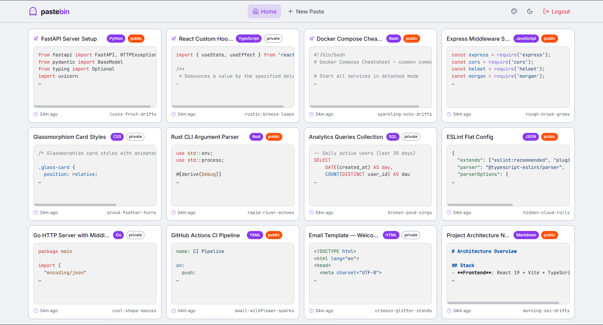
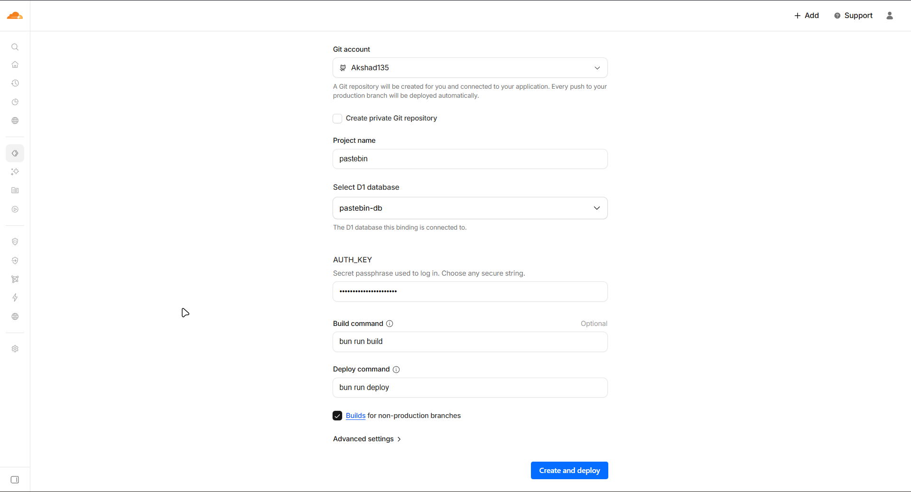

# pastebin

A self-hosted, private-first pastebin with syntax highlighting. Deploy on Cloudflare for free, or run it anywhere with Bun.

<div align="center">

[](https://deploy.workers.cloudflare.com/?url=https://github.com/Akshad135/paste-bin)

</div>

## Features

- **Syntax highlighting** — 50+ languages via [Shiki](https://shiki.style)
- **Single-user auth** — passphrase-protected, no accounts needed
- **PWA** — installable on mobile (Samsung Internet, Chrome, etc.)
- **Offline support** — cached pastes viewable without internet
- **5 color palettes** — dark and light modes for each
- **Pin pastes** — keep important pastes at the top
- **Public / private** — share pastes or keep them to yourself
- **Responsive** — works on desktop, tablet, and mobile
- **Zero tracking** — no analytics, no cookies beyond auth

## Screenshots

<div align="center">



*Tokyo Night — Dark*



*Catppuccin — Light*

</div>

**Other themes:** [Catppuccin Dark](public/themes/catppuccin-dark.png) · [Dracula Dark](public/themes/dracula-dark.png) · [Dracula Light](public/themes/dracula-light.png) · [Nord Dark](public/themes/nord-dark.png) · [Nord Light](public/themes/nord-light.png) · [Tokyo Night Light](public/themes/tokyo-night-light.png) · [Shadcn Dark](public/themes/shadcn-dark.png) · [Shadcn Light](public/themes/shadcn-light.png)

## Deploy — One Click

Click the deploy button above, set your `AUTH_KEY` secret when prompted, and you're done. Cloudflare automatically creates the D1 database and runs migrations.

<div align="center">



</div>

Cloudflare D1's free tier gives you 500 MB of storage — enough for roughly **100,000 pastes** at ~5 KB each.

## Local Development

### Prerequisites

- [Bun](https://bun.sh) (v1.0+)

### Setup

```bash
# Install dependencies
bun install

# Set your auth passphrase (.env is gitignored)
cp .env.example .env

# Run local DB migration
bun run db:migrate:local

# Start the API server (terminal 1)
bun run dev:api

# Start the frontend (terminal 2)
bun run dev
```

Open `http://localhost:5173` — the frontend proxies API requests to the dev server on `:8788`.

### Windows (PowerShell)

```powershell
.\setup.ps1
```

## Configuration

Branding is configured in [`config.yaml`](config.yaml) (committed to the repo). Edit it to customize your instance — app name, description, icons, etc.

Secrets like `AUTH_KEY` go in `.env` (gitignored) for local dev, or in Cloudflare dashboard secrets for production.

| File | Purpose | Committed? |
|------|---------|------------|
| `config.yaml` | Branding, icons, app name | Yes |
| `.env` | `AUTH_KEY` secret | No (gitignored) |
| `.dev.vars` | Secrets for `wrangler dev` | No (gitignored) |

> **Icons**: Drop your own images into `public/` and update `config.yaml`. The bundled ghost icon is used by default and adapts its color to the active theme.

## Tech Stack

| Layer | Tech |
|-------|------|
| Frontend | React 19, Vite, TypeScript, Tailwind CSS |
| Backend | Cloudflare Workers (prod) / Bun (dev) |
| Database | Cloudflare D1 (SQLite) |
| Syntax highlighting | Shiki |
| Icons | Lucide React |
