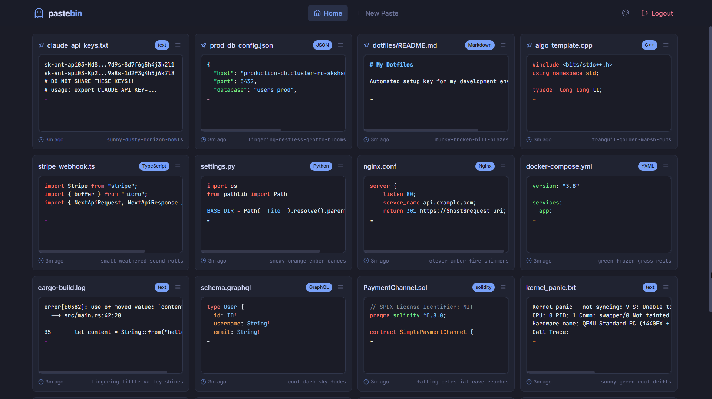
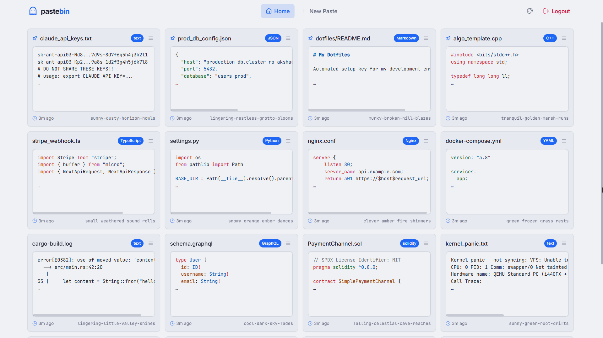

# pastebin

> A fast, self-hosted, private-first pastebin with syntax highlighting, file attachments, and End-to-End Encryption (E2EE), powered by Rust and React.

## Features

- Backend powered by Rust and SQLite
- Syntax highlighting for 50+ languages via [Shiki](https://shiki.style)
- File attachments with configurable size limits
- End-to-End Encryption (E2EE) derived from your auth passphrase
- Single-user authentication (no accounts needed)
- PWA support for mobile and desktop installation
- Pin important pastes to the top
- 8 Character Code based sharing
- Zero tracking (no analytics, no tracking cookies)

## Screenshots

<div align="center">



_Tokyo Night (Dark)_



_Catppuccin Latte (Light)_

</div>

<details>
<summary><b>View All 18 Themes</b></summary>

> *Themes ported from [herdr](https://github.com/ogulcancelik/herdr).*

### Dark Themes

- [Catppuccin](public/themes/dark-catppuccin.png)
- [Dracula](public/themes/dark-dracula.png)
- [Gruvbox](public/themes/dark-gruvbox.png)
- [Kanagawa](public/themes/dark-kanagawa.png)
- [Nord](public/themes/dark-nord.png)
- [One Dark](public/themes/dark-one.png)
- [Rosé Pine](public/themes/dark-rose-pine.png)
- [Solarized](public/themes/dark-solarized.png)
- [Terminal](public/themes/dark-terminal.png)
- [Tokyo Night](public/themes/dark-tokyo.png)
- [Vesper](public/themes/dark-vesper.png)

### Light Themes

- [Catppuccin Latte](public/themes/light-catppuccin.png)
- [Gruvbox Light](public/themes/light-gruvbox.png)
- [Kanagawa Lotus](public/themes/light-kanagawa.png)
- [One Light](public/themes/light-one.png)
- [Rosé Pine Dawn](public/themes/light-rose-pine.png)
- [Solarized Light](public/themes/light-solarized.png)
- [Tokyo Day](public/themes/light-tokyo.png)
</details>

## Getting Started (Docker)

You can run pastebin by pulling the pre-built Docker image or by building it yourself.

### Using Pre-built Image

```bash
docker run -d \
  -p 8788:8788 \
  -v pastebin-data:/app/data \
  -e AUTH_KEY="your_secure_passphrase" \
  akshad135/pastebin
```

### Build from Source

1. Clone the repository:

   ```bash
   git clone https://github.com/Akshad135/paste-bin.git
   cd paste-bin
   ```

2. Start the services via Docker Compose:

   ```bash
   # Make sure to set a secure AUTH_KEY. This protects login and derives the encryption key.
   AUTH_KEY="your_secure_passphrase" docker-compose up -d
   ```

3. Open `http://localhost:8788` in your browser.

> **Note:** You can also define `AUTH_KEY`, `MAX_TEXT_SIZE`, and `MAX_FILE_SIZE` in an `.env` file in the root directory.

## Local Build

If you want to run the project natively you will need **Node.js** and **Rust**.

### Prerequisites

- Node.js & npm
- Rust (`cargo`)

### Setup

```bash
# 1. Install frontend dependencies
npm install

# 2. Start the Rust backend (runs on :8788 by default)
# Make sure to set the AUTH_KEY environment variable.
AUTH_KEY="your_secure_passphrase" npm run dev:backend

# 3. Start the Vite frontend in a new terminal
npm run dev
```

Visit `http://localhost:5173` to see the frontend. API requests are automatically proxied to the backend.

## Configuration

Branding is configured in [`config.yaml`](config.yaml) (committed to the repo). Edit it to customize your instance (app name, description, icons, etc).

For backend limits, you can adjust environment variables:

- `MAX_TEXT_SIZE`: Max size in bytes for a text paste (Default: 512 KB).
- `MAX_FILE_SIZE`: Max size in bytes for a single file attachment (Default: 50 MB).

> **Icons**: Drop your own images into `public/` and update `config.yaml`. The bundled ghost icon is used by default and adapts its color to the active theme.
